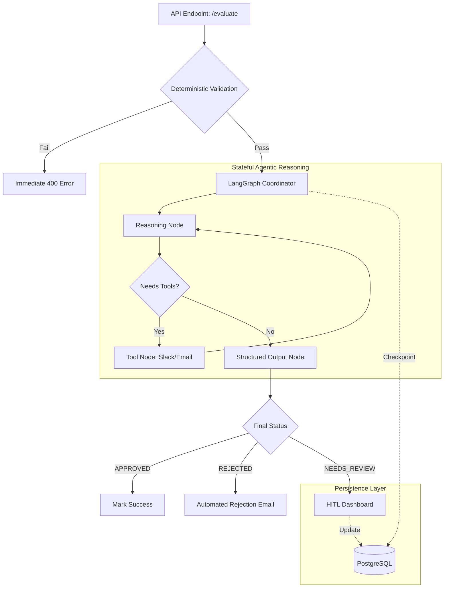

# System Architecture Overview

This document provides a deep dive into the technical design and architectural decisions behind the **Digital Postcard Automation Pipeline**.

## 🏗️ Architecture Diagram

## 🧠 Reasoning & Design Decisions

### 1. The "Workflow Runner" Pattern (System that Builds Systems)
Instead of hardcoding a single sequence of events, we implemented a generic `WorkflowRunner` in `src/engine/config_runner.py`. 
- **Reusability**: You can swap out the "Postcard QA" steps for "Inventory Check" or "Invoice Validation" by simply changing the configuration object.
- **Extensibility**: Adding a new step (e.g., "Language Translation") involves writing a single async function and calling `.add_step()`.

### 2. Failure Handling & Resilience
We assume that **failure is inevitable**. The system handles it at three levels:
- **Level 1: Network/Transient**: LLM calls use **Exponential Backoff** (3 retries).
- **Level 2: Logic/Quota**: If an LLM consistently fails (e.g., Quota 429), the exception is caught, and the item is automatically routed to the **Human Review Queue**.
- **Level 3: Operational**: Every state change is checkpointed to PostgreSQL. If the server crashes, the "thread" can be resumed from the last known good state.

### 3. Safe Tool Execution
The agent does not have "write" access to the world. It proposes actions. 
- **Auditability**: Every tool call is logged in the state machine.
- **Sandboxing**: Tools are executed in isolation, ensured by the `ToolNode` architecture, preventing the agent from "escaping" the intended workflow.

## 📊 Observability & Monitoring
To ensure the system remains healthy and cost-effective, we monitor:
- **Latent Costs**: Tracking token usage per `thread_id`.
- **Bottlenecks**: Measuring time spent in the "Reasoning Node" vs. "Tool Execution".
- **Quality Drift**: Comparing AI decisions against periodic human audits to identify if the "Brand Voice" is changing over time.
